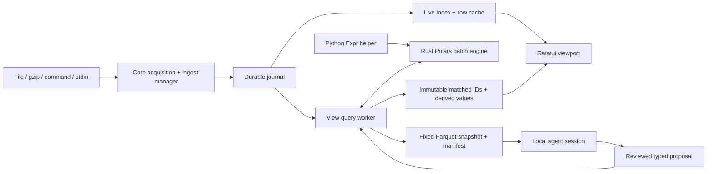

# lvu architecture

This is the current implementation map for contributors and future agents, checked
against source on 2026-09-06. Preview043 is the published baseline; later source
checkpoints are identified below and are not released features.

Read [README](../README.md) for supported product behavior, [TODO](../TODO.md) for
open work, [contracts](contracts.md) for invariants, and [preview notes](previews.md)
for binary-specific acceptance. The [implementation plan](implementation-plan.md)
is the broader design/roadmap and contains historical proposed layouts. Actual
module names and executable code take precedence over those proposals.

## Component map

| Component | Responsibility and starting points |
| --- | --- |
| `crates/lvu-app` | Executable/composition root. `src/main.rs` wires sources, views, terminal ticks, snapshots and assistance; `memory.rs`, `settings.rs`, `storage.rs`, `agent.rs` own their application workers and lifecycle. The reviewed command path uses `command_controller.rs`, `command_snapshot.rs`, `command_execution.rs` and `command_rows.rs`. |
| `crates/lvu` | Ratatui application state and rendering. `app.rs` owns actions, drafts and UI transactions; `terminal.rs` owns input/redraw/terminal restoration and `input.rs` the non-blocking descriptor crossterm reads through; `ui.rs` owns geometry. `command_palette.rs`, `theme.rs`, `delight.rs`, `text_selection.rs` provide shared presentation behavior. |
| `crates/lvu-core` | Source/record identities, acquisition, framing and lossless journal format. Start with `model.rs`, `acquisition.rs`, `journal.rs`. |
| `crates/lvu-ingest` | Durable source lifecycle: manager, journal writer, catalog, resume cursors, admission and shutdown. `SourceManager` returns shared `SourceHandle`s. |
| `crates/lvu-live` | Background indexing and bounded raw-row projection. `LiveRowProvider` implements the UI's synchronous paging seam without doing filesystem I/O on UI calls. |
| `crates/lvu-query` | Tolerant batch/schema projection, search parsing, expression validation, ordered enrichment execution, compiler subprocess and Parquet helpers. Start with `adapter.rs`, `validate.rs`, `engine.rs`, `host.rs`, `regex_enrichment.rs`. |
| `crates/lvu-view` | `NativeViewAdapter`: asynchronous query scheduling, incremental checkpoints, immutable membership publication, source-membership transactions, grouping and snapshots (`export.rs`). |
| `crates/lvu-memory` | SQLite working state and versioned TOML recipes, migration, immutable revisions and suggestion evidence. It does not capture logs. |
| `crates/lvu-discovery` | Bounded Docker, Linux process/open-file, project and remembered-source discovery. Candidates are suggestions, not acquisitions. |
| `crates/lvu-command-enrich` | Bounded external-command enrichment protocol, ordered delivery and attempt-store interface. SQLite integration/reopen tests exercise reservations and final results; the app command controller connects explicit reviewed execution to durable attempts. |
| `python/` | Pinned Python Polars expression construction/serialization helper, invoked on definition changes. Not a per-record execution service. |
| `bridge/` | TypeScript local Paseo adapter for sessions and typed proposals. This implementation name is intentionally absent from product UI. |
| `tests/pty/` | Actual terminal workflows, including capture, queries, dialogs, restart, copy and normal/panic cleanup. |

## Data path and ownership

A source owns capture; views reference it. Opening another view, filtering,
enriching or cloning must not launch another capture. Explicit source admission
and restart belong to the application/ingest lifecycle. Stdin gets a fresh source
identity per attachment and cannot be restarted without a new reader.

The journal owns exact bytes, delimiters, invalid UTF-8, capture timestamps and
physical identities. Display strings and parsed/derived fields are projections.
A record is addressed by source ID and sequence, not viewport position or time.
Acquisition generations and journal identity also fence caches and worker results.
Disposable V3 row indexes bind the journal acquisition identity, source,
generation and page geometry so different capture roots cannot reuse stale data.

Raw views can display before derived work completes. The terminal receives
bounded cached pages; indexing, reads, parsing, scans and export run in workers.
A cache miss is pending work, not proof that the record is absent.

## Drafts, revisions and atomic publication

Each view has separate editable drafts and accepted constraints. Search, advanced
filter, ordered enrichments and time bounds form a composite request. Filters
combine with AND. Stage IDs are stable; successful additions append, later stages
can depend on earlier outputs, and editing/removing a dependency must validate the
whole candidate. Failure retains the complete last accepted view and live refresh.

`NativeViewAdapter` owns mutable dispatch; `rows()` supplies a cloneable immutable
row-provider handle. The terminal composition tick drains bounded updates. Worker
results are fenced by request/base revisions, source generations and view identity.
An undrained candidate cannot mutate published rows or accepted checkpoints.
Queue refusal must roll back submission state rather than cancel the working view.

Membership is held in immutable `Arc` snapshots of per-source sequence IDs and
bounded derived/provenance data, not disk membership files. Applied and candidate
payloads both count toward admission. Incremental work resumes from in-session
source offsets/sequence checkpoints to a fixed high-watermark. Historical scans
must not chase continuously arriving input. Checkpoints are not persisted yet.

Merged views order records by explicit source position, then physical sequence.
They do not sort/interleave by event time. Source-list edits publish atomically
with query membership. Restart restoration waits for explicitly opened sources;
remembered commands are never started as a side effect of restoring a view.

## Expression execution and syntax

“Native” means Rust Polars executes record batches. Python constructs an Expr
when an advanced definition changes; the helper's JSON serialization crosses an
exact pinned compatibility boundary (Python Polars 1.44.1 / Rust Polars 0.55.2).
Do not independently upgrade one side without interoperability tests.

Custom syntax is deliberately limited to search addressing/literal/`/regex/ims`
forms, named enrichment assignment, named-capture regex shorthand, and time-dialog
inputs. These translate into the existing query engine. lvu does not implement a
second general Python, Polars or regex language. Regex enrichment lowers named
captures to native Polars string extraction and does not start Python.

Preview033 checks Python construction separately from native semantics.
Pinned Expr-returning constructors and public transformation namespaces are
available; eager data construction, I/O, callbacks, plugins and metadata tooling
are excluded. Rust checks structural restrictions, then converts to unoptimized
Polars IR without schema verification to require row-separable and length-preserving
metadata before publication, including empty captures. Real-schema lowering repeats
the metadata check at execution. Explicit string-to-time formats remain required.
Runtime row-count and identity
checks remain a backstop: shifting values can preserve IDs and shape while associating
a value with the wrong record; batch-dependent operations can change results after a
restart or different scan geometry. Functions absent from the pinned native feature
set report deserialization failures rather than misleading locality errors.

Preserve protected `_lvu_*` metadata, bounded expression size/depth, explicit
failure diagnostics and last-good rollback when extending support. A restricted
Python AST/globals environment is not a security sandbox. Test actual Python
serialization followed by Rust execution, including nulls, mixed types, multiple
batches and output alignment. Cancellation is between bounded batches; it does not
preempt a running Polars evaluation or kernel filesystem read.

## Persistence and budgets

| Storage | Authority and policy |
| --- | --- |
| `$XDG_CONFIG_HOME/lvu/settings.toml` | Global model, theme, motion and cache preferences; fallback `~/.config/lvu/settings.toml`. |
| `$XDG_DATA_HOME/lvu` | Default durable capture root; fallback `~/.local/share/lvu`. `--capture-dir` overrides it. Existing legacy `.lvu-captures` can be selected with a notice when the XDG data root does not yet exist; nothing is moved automatically. |
| `<capture-root>/workspace` | SQLite accepted state, independent drafts, navigation, presentation, sources and recipe metadata; canonical recipes under its `recipes/` directory. |
| `<capture-root>/workspace/session.json` | The sources of the most recent session in this capture root, in sidebar order, including ones that could not be acquired. Read at startup to re-acquire the set; rewritten whenever the set changes. Additive and unversioned against the workspace schema: an older binary ignores it and an unreadable one degrades to no previous session. |
| `$XDG_CACHE_HOME/lvu` | Disposable derived-index storage; fallback `~/.cache/lvu`. |
| Investigation directories | Fixed datasets, manifests and session metadata retained with the capture workspace. Not cache cleanup targets. |

Empty or relative XDG environment values are ignored. See
[settings.example.toml](settings.example.toml) and `lvu-app/src/settings.rs` for
canonical fields, validation and environment override semantics. Cache changes
require restart; theme preview can apply live. Saved model settings must not reuse
an incompatible cached session. Existing investigations keep their creation model.

Memory caps account managed row/membership payloads, not total process RSS or all
Polars allocator overhead. The global disk cap covers derived indexes, not raw
journals, SQLite, recipes or exported snapshots. A cross-process ledger reserves
index growth before mutation; differing active caps refuse growth. Failed writes
must reconcile observed size before releasing reservations. Unknown/unverifiable
artifacts are counted conservatively or stop growth.

Storage cleanup is explicit and limited to reviewed, verified, unused derived
indexes. Linux handle-relative operations, ownership locks and file/directory
identity checks protect replacement races. Never turn a cache limit into silent
deletion of durable data. Automatic eviction and complete ownership-aware capture
retention remain open work.

Working-state saves run through a bounded worker with interaction/revision fences,
coalescing and a bounded final flush. Recipe revisions are immutable: TOML
publication and SQLite transactions use locks/reconciliation rather than assuming
two separate files can be updated atomically. Future-version or malformed state
must report an error, not be reset or overwritten silently.

## Snapshots and assistance

Export freezes the applied revision, source generations, membership and resolved
time bounds. Source-context parts retain all records through those boundaries;
filtered parts retain the accepted view and derived columns. The exporter replays
accepted enrichment batch boundaries with their pre-evaluation schema context so
part sizing cannot change typed interpretation. Manifest v2 references a bounded
schema dictionary; compatible batches share bounded Parquet files with separate
row groups. A shared byte budget covers active writers and footer finalization.
Only an atomically published manifest means export completed successfully.

Short Ask prepares context without a full
Parquet export. Two bounded passes count actual row ordinals and select evenly
spaced samples per source. Schema evidence covers the replay independently of
retained samples; canonical projected values and raw type provenance remain
separate. The complete inline JSON envelope is at most 32 KiB, with whole-value/
row omissions. Cancelled jobs retain admission until worker settlement.

Full investigations retain local manifest/dataset paths and receive a bounded
Python inspection entrypoint compatible with v1/v2 manifests. Additional
short-context inspection after omissions is not yet wired. Both paths are published in preview041 and retain typed proposal schemas.
Proposals are reviewed and then submitted through the same query/source admission
paths as manual actions. JSON-schema validity does not establish expression
semantics, data correctness or revision freshness; all require validation.
Timestamp assistance should inspect actual usable typed fields first, regardless
of their names, and produce `timestamp_utc`. Raw extraction is a fallback requiring
evidence. Capture time is not a substitute for a missing event timestamp.

Preview033 manifests include deterministic part-relative row offsets,
evenly spaced across each source, with at most 128/source and 512 total. Applied
typed outputs are preferred; sources without matches use explicit source-context
fallback. Prompts request all schemas and actual coverage reporting. Both outgoing
JSON schemas bind exact requested revisions; runtime revision checks remain.
An actual Luna proposal and persisted native output passed acceptance. A prompt
read budget is not an enforced remote
I/O limit; snapshot size limits and agent sample coverage are different measures.

The Rust bridge host owns request correlation, framing, deadlines, stderr draining,
process groups and bounded cleanup. Session ownership persists until cancellation
is confirmed. Generation fences prevent stale responses/cancellation from affecting
new work. Offline helpers must leave raw browsing usable. Product labels use 🧠
(or `Agent` in ASCII mode), not the backend product name.

## Command enrichment (published since preview034)

The optional terminal command step follows the accepted native enrichment chain.
`command_controller.rs` coordinates definition persistence, frozen review, confirmed
execution and durable publication through bounded workers. `command_snapshot.rs`
uses `NativeViewAdapter::freeze_input` and validates saved result references;
`command_execution.rs` adapts the runner to SQLite attempt reservations and immutable
results. `command_rows.rs` adds read-only Details fields without changing native
membership, field choices, raw context or captures.

Definitions and published-result references are independent. Edits retain the last
explicit result set; live arrivals are Pending until another confirmed run.
Restoration loads durable results without launching remembered commands. Failed or
reserved attempts never silently become new deliveries. Details has a bounded
per-view scroll offset, reset on stable selected-record changes; its visible pane
owns keyboard and mouse scrolling and a reserved action footer.

The controller and actual-app workflow passed combined acceptance. Before result
save admission, cancellation and definition fences apply. Accepted save admission
changes the UI to Saving results with Close only; acknowledgement publishes the
accepted reference even after dialog closure. Restoration follows the immutable
publication reference independently of later command-definition edits.
See [command enrichment](command-enrichment.md) for bounds and the schema-v4
compatibility change; preview033 and earlier do not contain this feature.

## Terminal boundaries and verification

`terminal.rs` owns the event loop and terminal modes. Render geometry also defines
mouse hitboxes, scroll extents, cursors and modal text-selection bounds; never
calculate those independently. Long and Unicode drafts must keep the cursor and
selected list row visible without overlapping the shortcut footer. All surfaces
use semantic roles from `theme.rs`. [Dialog presentation](dialog-design.md) defines
the editable/help/status/results/actions hierarchy and narrow-layout requirements;
[the dialog system](dialog-system.md) §8.9 gives every dialog one filled default
action that Enter runs, audited per dialog in
[dialog-default-actions.md](dialog-default-actions.md); §8.10 says where a user
learns what they can do (button mnemonics, hint line, palette, Help), audited in
[dialog-discoverability.md](dialog-discoverability.md); §8.11–§8.13 give nested
JSON a tree with per-view expansion memory, Fields a Value pane over a bounded
sample, and the editors a field-path picker, audited in
[field-exploration.md](field-exploration.md).

A record's colour is decided in three functions and nowhere else:
`details::json_kind_style` turns a JSON token into a colour, `ui::record_style`
gives a record its row colour (selection, then the view's colour field hashed
through `Theme::value_color`, then severity), and `ui::styled_record_text`
combines them for a piece of text. The log pane and the docked Details pane both
go through them, so the same record reads the same in both and a new colouring
input reaches every surface at once. Both draw on `base_bg`, because an identity
colour is lifted until it clears `MIN_IDENTITY_CONTRAST` against that background
and nowhere else.

Terminal input arrives through a private non-blocking descriptor installed by
`input.rs` before any crossterm call and put back by the same guard that restores
the terminal modes. crossterm reads by looping `read(2)` until its parser yields
an event and leaves that loop only on `WouldBlock`, so on the caller's blocking
standard input a read carrying just the start of an escape sequence slept inside
`event::poll`: no poll timeout, no SIGWINCH, no frame and no restoration. The
descriptor must stay private, because a shell gives descriptors 0, 1 and 2 one
open file description and `O_NONBLOCK` on it would let frame writes fail with
`EAGAIN`. A resize clear belongs in the same synchronized update as the frame
that repaints it; presented alone it flashes the whole screen.

Visible text copy uses OSC 52, with bounded selection storage and output. It is a
clipboard request, not an acknowledgement; support depends on the terminal and
multiplexer. Preview033 confines selection to the rendered modal or
originating pane, invalidates the terminal cache on every resize, supports Ctrl-L
recovery and brackets drawing with synchronized updates. Wrap is disabled while
the TUI runs and restored on exit. Boundary clipboard and resize/live-arrival PTYs
pass. Preserve terminal
restoration on normal exit, startup failure, cancellation and panic. Child stdout
must never bypass owned pipes into the active TUI.

Use mise tasks listed in the README. Rust unit tests alone cannot prove Python/Rust
interop, real capture, terminal geometry or actual provider integration. PTY tests
must assert semantic screen/data outcomes, send complete key/mouse lifecycles and
use readiness handshakes. Do not hide races by weakening assertions or inflating
timeouts. Keep fixture/live-provider evidence and skipped checks in the work ledger.

## Change checklist

1. Locate the owning component and trace its application wiring; a library API is
   not automatically a user-visible feature.
2. State the durable authority, revision fence, bounded resource and failure path
   affected by the change.
3. Change shared DTOs, persistence migration, compiler/bridge schema and UI together
   where necessary; preserve legacy source text and stable identities.
4. Validate the actual boundary: Python→Rust, journal→view, or UI→PTY as appropriate.
5. Update README, TODO and this map when behavior changes. Publish a new immutable
   preview only after testing the copied binary; never overwrite prior previews.

### JSON presentation and empty Fields

`json_spans.rs` lexes complete valid JSON within fixed size/token/depth bounds.
Original byte spans drive rendering; decoded keys drive stable continuous RGB
colors. Invalid or oversized input falls back to ordinary row styling. Selected
row contrast takes priority, and styled clipping preserves Unicode boundaries.
Identity colours resolve against what the terminal can show, in three depths
(`ColorDepth::detect`): a `COLORTERM` truecolor claim gives 24-bit; a `TERM`
naming `256color` or `direct` gives the xterm cube, quantised and
contrast-checked there so the measured colour is the displayed one; anything
else — `xterm`, `screen`, `linux`, `vt100` — has sixteen colours and gets them
by name. `tput colors` is consulted only when `TERM` says nothing at all, so the
ordinary paths spawn no process. On the cube the hash picks a step along the
ring's radius as well as its hue, because quantising a single fixed-lightness
ring collapsed 256 identities onto a dozen colours. At sixteen colours the hue
is taken by angle onto the six usable non-grey ANSI colours — so a value whose
truecolor colour is orange lands on red or yellow rather than somewhere
unrelated — and bold is the seventh axis, giving twelve appearances rather than
six; slots whose conventional xterm RGB does not clear `MIN_IDENTITY_CONTRAST`
against the theme's background are skipped deterministically. Levels and the
five JSON scalar kinds take ANSI names there rather than theme RGB the terminal
would have to approximate. All of it arrives through `ui::record_style` and
`details::json_kind_style`, so the log pane and the Details pane change
together.

Chrome resolves earlier, in `Theme::with_depth`, so nothing downstream has to
know the depth: at sixteen colours every role is already an ANSI colour by the
time a component reads it. Two rules decide each one. A **surface** lvu cannot
know — the base and dialog backgrounds and the input tone — inherits the
terminal's own (`Color::Reset`), because this palette has no third neutral to
spend on a tone and painting one of sixteen colours the user may have remapped
over their own background is a guess rather than a surface. A **filled region**
lvu draws both halves of — the selection and §8.9's accent fill — takes ANSI
colours with its foreground chosen against the other half and measured on
xterm's palette, so that floor is real. That is the pair that matters: a
selection emitted as 24-bit and approximated onto the nearest of sixteen can
land on the background it was meant to stand out from, and nothing in lvu would
know. §8.10's mnemonic is an underline rather than a colour and needs no
palette at all. `Theme::contrast_background` is what the identity floor is
measured against once the painted background is the terminal's: the theme the
user chose is the proxy, because choosing `love-dark` is a statement that the
terminal is dark. A user who has remapped their sixteen colours sees their own
palette; lvu measures against xterm's convention because that is the only thing
it can know. `NO_COLOR` is honoured by crossterm where sequences are emitted
and is deliberately not read again in lvu. Terminal theme has unknown background
and no measured contrast guarantee. Fields opens for empty or unavailable data,
freezes the selected record identity and permits raw-context inspection.

### Field correlation across sources

`lvu-core/correlation.rs` owns the exact typed scalar, the single-field
`ExactFieldConstraint` and `FieldCorrelation`, which maps *each source id* to
the field carrying one identity. Sources name the same identity differently, so
the mapping is explicit and per source; a source absent from it contributes no
records and its field name is never inferred from another source's.

`r` in Fields freezes the selected record identity and queues a fenced
`CorrelationRequest`. `NativeViewAdapter::submit_correlation_lookup` runs one
bounded, cancellable lookup on its own thread: a page-by-page scan for that
sequence, `resolve_exact_field` on the original bytes (never the displayed
string), then a bounded head sample of each source's structured field names,
reported with an explicit incompleteness flag. Only one lookup is in flight;
cancelling or leaving the origin view drops its result.

The accepted mapping is an ordinary merged view whose accepted constraints
carry `QueryConstraints::exact_field`. The query worker projects each batch with
`records_to_batch_with_context_and_exact_field` for that source's mapped field
and executes `execute_batch_with_exact_constraint` in the same native predicate
plan as text and advanced filters — there is no second evaluator and no second
membership. A field outside the bounded canonical projection fails the candidate
explicitly rather than matching nothing. The view's sources follow the order the
user opened them, so records stay in explicit source position then sequence.

A correlation has no draft: it is accepted state or nothing. It persists in
`PresentationState::exact_field`, restores as accepted before the first scan
completes, and is fenced against the previously applied correlation, so a
rejected or cancelled candidate keeps the whole last-good chain.

### Shared editing and Time forms

`text_edit.rs` provides bounded cursor state and Unicode-aware line editing.
`App` exposes text targets only for editable controls; menu/dropdown selections
do not mutate hidden drafts. Movement does not dirty persistence. Time uses
grouped Start/End controls, staged UTC/offset selection and custom-offset inputs.
Enrichment and external-command forms expose actions as visible buttons.
Enrichment is two nested layers built to `dialog-system.md`: `Enrichment`
(class L) lists the ordered steps and the external-command summary with
Add/Edit/Remove actions, and `Enrichment › New step` / `› Edit step` (class L
child) holds one expression field, the record it reads, the output the accepted
chain produced, and Save/Remove. Save returns to the list only once the step is
accepted; a rejected draft keeps its own layer and the whole accepted chain.
Escape closes the completion popup, then the step editor, then the list. Both
layers use the §3 region order, the §7.4 message row and §8.7 panes; the layout,
scrim and pane helpers are private to `ui.rs` until the shared `dialog_layout`
module exists.

Repeated-run folding (`lvu-view/src/folding.rs`) collapses consecutive rows that
share one key. The key is the value of exactly one column per view: by default a
derived `pattern` column — the row text with timestamps, ids, paths and numbers
replaced and the level prefixed — and otherwise any column the rows carry,
including an enrichment column, whose value is used unchanged. Normalisation
aggressiveness therefore governs the derived column only. Folding is reversible
presentation: no record is dropped, reordered or rewritten, every constituent
stays addressable by its `RowId`, and every sampling consumer reads
`RowProvider::unfolded_page`. The `Folding` layer (`z`, class M) sets the key
column, minimum run, scope and normalisation, and persists them with the view;
folding on several fields is an enrichment column built from them, which its
picker creates by opening the ordinary step editor pre-filled.

Settings uses explicit control focus, a staged theme dropdown and a bounded
overflow/details viewport. A late save acknowledgment advances the rollback
baseline without replacing a newer dialog draft or preview. Its keyboard focus
and mouse hitboxes share rendered control bounds.

Managed assistance uses a stable workspace under the absolute assistance root.
Ask and source helpers use fresh ephemeral sessions; investigations remain
resumable. Ownership and bounded activity are durable before confirmed archive.
Archive acknowledgements have a separate bounded host queue; saturation faults
explicitly and retains ownership for recovery. Normal EOF shutdown releases the
nonce-owned bridge lease and reaps its process group. Existing stale leases are
conservatively refused, not automatically removed.
