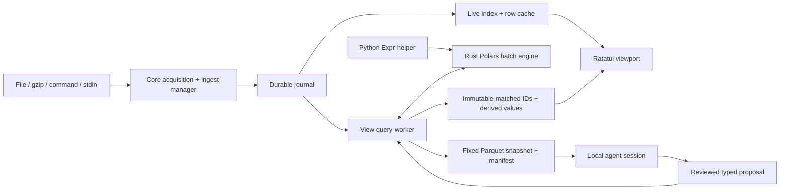

# lvu architecture

This is the current implementation map for contributors and future agents, checked
against source on 2026-09-06. Preview032 is the published baseline; later source
checkpoints are identified below and are not released features.

Read [README](../README.md) for supported product behavior, [TODO](../TODO.md) for
open work, [contracts](contracts.md) for invariants, and [preview notes](previews.md)
for binary-specific acceptance. The [implementation plan](implementation-plan.md)
is the broader design/roadmap and contains historical proposed layouts. Actual
module names and executable code take precedence over those proposals.

## Component map

| Component | Responsibility and starting points |
| --- | --- |
| `crates/lvu-app` | Executable/composition root. `src/main.rs` wires sources, views, terminal ticks, snapshots and assistance; `memory.rs`, `settings.rs`, `storage.rs`, `agent.rs` own their application workers and lifecycle. |
| `crates/lvu` | Ratatui application state and rendering. `app.rs` owns actions, drafts and UI transactions; `terminal.rs` owns input/redraw/terminal restoration; `ui.rs` owns geometry. `command_palette.rs`, `theme.rs`, `delight.rs`, `text_selection.rs` provide shared presentation behavior. |
| `crates/lvu-core` | Source/record identities, acquisition, framing and lossless journal format. Start with `model.rs`, `acquisition.rs`, `journal.rs`. |
| `crates/lvu-ingest` | Durable source lifecycle: manager, journal writer, catalog, resume cursors, admission and shutdown. `SourceManager` returns shared `SourceHandle`s. |
| `crates/lvu-live` | Background indexing and bounded raw-row projection. `LiveRowProvider` implements the UI's synchronous paging seam without doing filesystem I/O on UI calls. |
| `crates/lvu-query` | Tolerant batch/schema projection, search parsing, expression validation, ordered enrichment execution, compiler subprocess and Parquet helpers. Start with `adapter.rs`, `validate.rs`, `engine.rs`, `host.rs`, `regex_enrichment.rs`. |
| `crates/lvu-view` | `NativeViewAdapter`: asynchronous query scheduling, incremental checkpoints, immutable membership publication, source-membership transactions, grouping and snapshots (`export.rs`). |
| `crates/lvu-memory` | SQLite working state and versioned TOML recipes, migration, immutable revisions and suggestion evidence. It does not capture logs. |
| `crates/lvu-discovery` | Bounded Docker, Linux process/open-file, project and remembered-source discovery. Candidates are suggestions, not acquisitions. |
| `crates/lvu-command-enrich` | Bounded external-command enrichment protocol and attempt ledger. Built and tested as a library; not yet connected to the app's enrichment editor. |
| `python/` | Pinned Python Polars expression construction/serialization helper, invoked on definition changes. Not a per-record execution service. |
| `bridge/` | TypeScript local Paseo adapter for sessions and typed proposals. This implementation name is intentionally absent from product UI. |
| `tests/pty/` | Actual terminal workflows, including capture, queries, dialogs, restart, copy and normal/panic cleanup. |

## Data path and ownership

A source owns capture; views reference it. Opening another view, filtering,
enriching or cloning must not launch another capture. Explicit source admission
and restart belong to the application/ingest lifecycle. Stdin gets a fresh source
identity per attachment and cannot be restarted without a new reader.

The journal owns exact bytes, delimiters, invalid UTF-8, capture timestamps and
physical identities. Display strings and parsed/derived fields are projections.
A record is addressed by source ID and sequence, not viewport position or time.
Acquisition generations and journal identity also fence caches and worker results.
Disposable V3 row indexes bind the journal acquisition identity, source,
generation and page geometry so different capture roots cannot reuse stale data.

Raw views can display before derived work completes. The terminal receives
bounded cached pages; indexing, reads, parsing, scans and export run in workers.
A cache miss is pending work, not proof that the record is absent.

## Drafts, revisions and atomic publication

Each view has separate editable drafts and accepted constraints. Search, advanced
filter, ordered enrichments and time bounds form a composite request. Filters
combine with AND. Stage IDs are stable; successful additions append, later stages
can depend on earlier outputs, and editing/removing a dependency must validate the
whole candidate. Failure retains the complete last accepted view and live refresh.

`NativeViewAdapter` owns mutable dispatch; `rows()` supplies a cloneable immutable
row-provider handle. The terminal composition tick drains bounded updates. Worker
results are fenced by request/base revisions, source generations and view identity.
An undrained candidate cannot mutate published rows or accepted checkpoints.
Queue refusal must roll back submission state rather than cancel the working view.

Membership is held in immutable `Arc` snapshots of per-source sequence IDs and
bounded derived/provenance data, not disk membership files. Applied and candidate
payloads both count toward admission. Incremental work resumes from in-session
source offsets/sequence checkpoints to a fixed high-watermark. Historical scans
must not chase continuously arriving input. Checkpoints are not persisted yet.

Merged views order records by explicit source position, then physical sequence.
They do not sort/interleave by event time. Source-list edits publish atomically
with query membership. Restart restoration waits for explicitly opened sources;
remembered commands are never started as a side effect of restoring a view.

## Expression execution and syntax

“Native” means Rust Polars executes record batches. Python constructs an Expr
when an advanced definition changes; the helper's JSON serialization crosses an
exact pinned compatibility boundary (Python Polars 1.44.1 / Rust Polars 0.55.2).
Do not independently upgrade one side without interoperability tests.

Custom syntax is deliberately limited to search addressing/literal/`/regex/ims`
forms, named enrichment assignment, named-capture regex shorthand, and time-dialog
inputs. These translate into the existing query engine. lvu does not implement a
second general Python, Polars or regex language. Regex enrichment lowers named
captures to native Polars string extraction and does not start Python.

The current compiler checks Python expression construction and validates the
serialized Rust Expr against a restricted set. Broader acceptance using Polars
plan metadata is pending work, not a shipped capability. Runtime row-count and
identity checks are necessary but insufficient: shifting values can preserve IDs
and shape while associating a value with the wrong record; batch-dependent
operations can change results after a restart or different scan geometry.

Preserve protected `_lvu_*` metadata, bounded expression size/depth, explicit
failure diagnostics and last-good rollback when extending support. A restricted
Python AST/globals environment is not a security sandbox. Test actual Python
serialization followed by Rust execution, including nulls, mixed types, multiple
batches and output alignment. Cancellation is between bounded batches; it does not
preempt a running Polars evaluation or kernel filesystem read.

## Persistence and budgets

| Storage | Authority and policy |
| --- | --- |
| `$XDG_CONFIG_HOME/lvu/settings.toml` | Global model, theme, motion and cache preferences; fallback `~/.config/lvu/settings.toml`. |
| `$XDG_DATA_HOME/lvu` | Default durable capture root; fallback `~/.local/share/lvu`. `--capture-dir` overrides it. Existing legacy `.lvu-captures` can be selected with a notice when the XDG data root does not yet exist; nothing is moved automatically. |
| `<capture-root>/workspace` | SQLite accepted state, independent drafts, navigation, presentation, sources and recipe metadata; canonical recipes under its `recipes/` directory. |
| `$XDG_CACHE_HOME/lvu` | Disposable derived-index storage; fallback `~/.cache/lvu`. |
| Investigation directories | Fixed datasets, manifests and session metadata retained with the capture workspace. Not cache cleanup targets. |

Empty or relative XDG environment values are ignored. See
[settings.example.toml](settings.example.toml) and `lvu-app/src/settings.rs` for
canonical fields, validation and environment override semantics. Cache changes
require restart; theme preview can apply live. Saved model settings must not reuse
an incompatible cached session. Existing investigations keep their creation model.

Memory caps account managed row/membership payloads, not total process RSS or all
Polars allocator overhead. The global disk cap covers derived indexes, not raw
journals, SQLite, recipes or exported snapshots. A cross-process ledger reserves
index growth before mutation; differing active caps refuse growth. Failed writes
must reconcile observed size before releasing reservations. Unknown/unverifiable
artifacts are counted conservatively or stop growth.

Storage cleanup is explicit and limited to reviewed, verified, unused derived
indexes. Linux handle-relative operations, ownership locks and file/directory
identity checks protect replacement races. Never turn a cache limit into silent
deletion of durable data. Automatic eviction and complete ownership-aware capture
retention remain open work.

Working-state saves run through a bounded worker with interaction/revision fences,
coalescing and a bounded final flush. Recipe revisions are immutable: TOML
publication and SQLite transactions use locks/reconciliation rather than assuming
two separate files can be updated atomically. Future-version or malformed state
must report an error, not be reset or overwritten silently.

## Snapshots and assistance

Export freezes the applied revision, source generations, membership and resolved
time bounds. Source-context parts retain all records through those boundaries;
filtered parts retain the accepted view and derived columns. The exporter replays
accepted enrichment batch boundaries with their pre-evaluation schema context so
part sizing cannot change typed interpretation. Each part records its schema.
Only an atomically published manifest means export completed successfully.

Assistance receives local manifest/dataset paths and typed proposal schemas.
Proposals are reviewed and then submitted through the same query/source admission
paths as manual actions. JSON-schema validity does not establish expression
semantics, data correctness or revision freshness; all require validation.
Timestamp assistance should inspect actual usable typed fields first, regardless
of their names, and produce `timestamp_utc`. Raw extraction is a fallback requiring
evidence. Capture time is not a substitute for a missing event timestamp.

Preview032 requests bounded sampling but does not enforce a per-source read count.
Post-preview032 source manifests include deterministic part-relative row offsets,
evenly spaced across each source, with at most 128/source and 512 total. Applied
typed outputs are preferred; sources without matches use explicit source-context
fallback. Prompts request all schemas and actual coverage reporting. Both outgoing
JSON schemas bind exact requested revisions; runtime revision checks remain.
An actual Luna proposal and persisted native output passed acceptance. This source
checkpoint is not yet published. A prompt read budget is not an enforced remote
I/O limit; snapshot size limits and agent sample coverage are different measures.

The Rust bridge host owns request correlation, framing, deadlines, stderr draining,
process groups and bounded cleanup. Session ownership persists until cancellation
is confirmed. Generation fences prevent stale responses/cancellation from affecting
new work. Offline helpers must leave raw browsing usable. Product labels use 🧠
(or `Agent` in ASCII mode), not the backend product name.

## Terminal boundaries and verification

`terminal.rs` owns the event loop and terminal modes. Render geometry also defines
mouse hitboxes, scroll extents, cursors and modal text-selection bounds; never
calculate those independently. Long and Unicode drafts must keep the cursor and
selected list row visible without overlapping the shortcut footer. All surfaces
use semantic roles from `theme.rs`.

Visible text copy uses OSC 52, with bounded selection storage and output. It is a
clipboard request, not an acknowledgement; support depends on the terminal and
multiplexer. Post-preview032 source confines selection to the rendered modal or
originating pane, invalidates the terminal cache on every resize, supports Ctrl-L
recovery and brackets drawing with synchronized updates. Wrap is disabled while
the TUI runs and restored on exit. Boundary clipboard and resize/live-arrival PTYs
pass; these fixes are not yet published. Preserve terminal
restoration on normal exit, startup failure, cancellation and panic. Child stdout
must never bypass owned pipes into the active TUI.

Use mise tasks listed in the README. Rust unit tests alone cannot prove Python/Rust
interop, real capture, terminal geometry or actual provider integration. PTY tests
must assert semantic screen/data outcomes, send complete key/mouse lifecycles and
use readiness handshakes. Do not hide races by weakening assertions or inflating
timeouts. Keep fixture/live-provider evidence and skipped checks in the work ledger.

## Change checklist

1. Locate the owning component and trace its application wiring; a library API is
   not automatically a user-visible feature.
2. State the durable authority, revision fence, bounded resource and failure path
   affected by the change.
3. Change shared DTOs, persistence migration, compiler/bridge schema and UI together
   where necessary; preserve legacy source text and stable identities.
4. Validate the actual boundary: Python→Rust, journal→view, or UI→PTY as appropriate.
5. Update README, TODO and this map when behavior changes. Publish a new immutable
   preview only after testing the copied binary; never overwrite prior previews.
